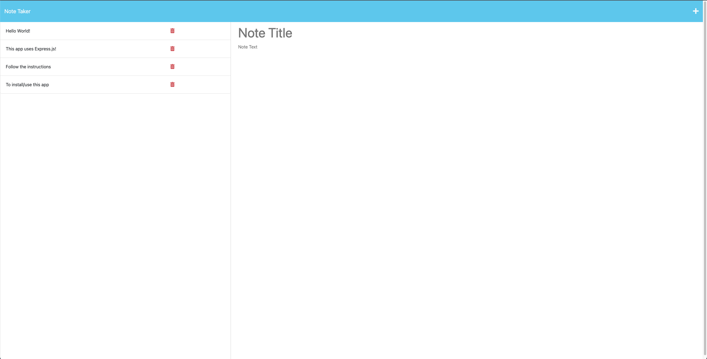

# Note Taker!

## Description:
This application is a note taking application utilizing Express.js as the back end and will save and retrieve the note data from a JSON file.

## Screenshot:

## Table of Contents:

* [Installation](#installation)
* [Usage](#usage)
* [License](#license)
* [Email](#Email)
* [Github](#Github)
* [Owner](#Owner)

## Installation:

Clone to a local repo. Type 'npm i' into the terminal.

## Usage:

Then run 'npm start' to serve app to browser. Then open the website on your local server (http://localhost:3001/)

## License

This project is licensed under the MIT license. Click [here](https://opensource.org/licenses/MIT) for more information. 

## Email:
If you have any questions email me directly at DomenicoABarberi@gmail.com.

## Github:
Please visit my [GitHub](https://github.com/DomenicoBarb) to view my other work.

## Owner:
Nico Barberi
